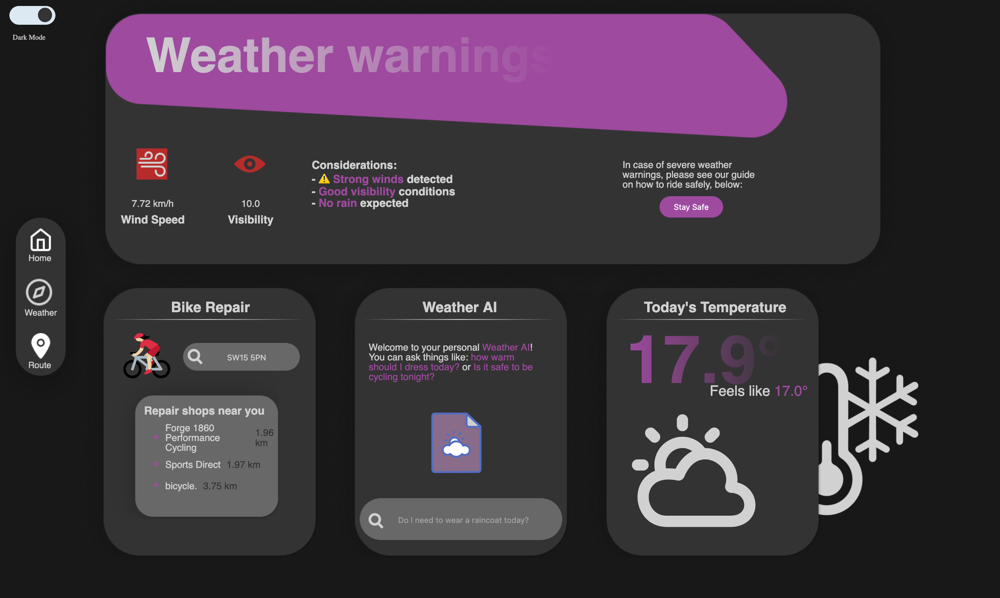

# WeatherApp

<!-- TABLE OF CONTENTS -->
<details>
  <summary>Table of Contents</summary>
  <ol>
    <li><a href="#about-the-project">About The Project</a></li>
    <li><a href="#set-up">Set Up</a>
      <ul>
        <li><a href="#dependencies">Dependencies</a></li>
        <li><a href="#app-installation">App Installation</a></li>
        <li><a href="#alternative-installation-of-zip">Zip Alternative Installation</a></li>
      </ul>
    </li>
    <li><a href="#usage-guidelines">Usage Guidelines</a></li>
    <li><a href="#accessibility-features">Accessibility Features</a></li>
  </ol>
</details>


<!-- ABOUT THE PROJECT -->
## About The Project





Whether you cycle casually, everyday or simply like knowing the weather forecast or plan best routes, this app is for you. Our weather app makes use of React, with options for a dark and light theme for easier viewing.

Services the application offers includes:
- Real-time weather updates
    - Of your current location and any other location you search for
    - Includes humidity, pressure, windspeed, visibility, precipitation and UV metrics
- Hourly weather updates
    - Accompanied by a graph for better visual
    - Also displays the time for sunrise and sunset
- Weekly weather forecast
- Dark and Light mode toggle to customise the app's theme to preferences
- Forecast page with weather warnings and a safety guide
- Search option for locating the nearest bicycle repair shops
- A personal Weather AI for advice on what to wear based on the weather, among other related advice
- A panel for today's temperature and what it feels like


<!-- SETTING UP -->
## Set Up

1. **Supported Operating Systems**:
   - Windows
   - MacOS
   - Android
   - IOS

2. **System Requirements**:
   - Node.js: ^14.0.0

3. **Compatible Browsers**
   - Chrome: version 109 or higher
   - Edge: version 132 or higher
   - Firefox: version 115 or higher
   - Safari: version 16.6 or higher
   - Samsung: version 27
  
## Dependencies

| **Package**                      | **Version**     |
|-----------------------------------|-----------------|
| `@testing-library/jest-dom`       | `5.17.0`        |
| `@testing-library/react`          | `^13.4.0`       |
| `@testing-library/user-event`     | `^13.5.0`       |
| `axios`                           | `^1.7.9`        |
| `cors`                            | `^2.8.5`        |
| `react`                           | `^18.2.0`       |
| `react-dom`                       | `^18.2.0`       |
| `react-router-dom`                | `^7.4.0`        |
| `react-scripts`                   | `5.0.1`         |
| `web-vitals`                      | `^2.1.4`        |

To install all necessary dependencies, run the following command in your terminal
   ```sh
   npm install axios
   ```

## App Installation

1. Clone the repository
   ```sh
   git clone https://github.com/Pie-R-Squared/WeatherApp.git
   ```
2. Navigate to project directory
   ```sh
   cd WeatherApp
   ```
3. Install the required node modules
   ```sh
   npm install
   ```
4. Start the node server for the backend
   ```sh
   node server.js
   ```
5. Run the React application
   ```sh
   npm start
   ```

## Alternative Installation of Zip

1. Download the zip file from the repository

<image src="assets/projectZipDownload.png" alt="zip" width="300"/>

Download size: approx. 3.6MB

2. Go to the Downloads folder and extract the file

3. Open the terminal and locate the file
   ```sh
   cd Downloads\WeatherApp
   ```
4. Install the required node modules
   ```sh
   npm install
   ```
5. Start the node server for the backend
   ```sh
   node server.js
   ```
6. Run the React application
   ```sh
   npm start
   ```


<!-- USAGE EXAMPLES -->
## Usage Guidelines


Search for a place for which you want to get the weather data for, using the search bar at the top. In the middle of the screen, you will see a display for the current temperature in the given location. This is accompanied by some information for how cloudy, sunny or rainy it is. Below this, you will find the weather forecast for the next few days, at the searched location. In the top right, there is a panel for humidity, pressure, windspeed, visibility, precipitation and UV metrics - information that may help cyclists decide when to depart and how to plan their route. A graph for the hourly weather updates is also provided to better visualise how it will fluctuate throughout the day.

Using the navigation tab on the left, navigate to either the Forecast or Route pages. The Forecast (or Weather) page informs users of the windspeed and visibility conditions, offering some advice on what they mean for travel. To ensure cyclists are travelling safely, particularly at times of heavy rain or wind, we have provided a downloadable safety guide.


Cyclists can also choose to search for the nearest repair shops by typing a postcode, which provides the three nearest ones and their distances. A simple Weather AI has also been implemented to accept prompts related to the weather and respond with some helpful advice. Finally, the last panel gives an overview of today's temperature and what it feels like.

<!-- INSERT ROUTES DETAILS HERE -->


<!-- ACCESSIBILITY FEATURES -->
## Accessibility Features

### Homepage with light theme on tablet layout
<image src="assets/home_responsive.png" alt="zip" width="300"/>

### Forecast page with light theme on mobile layout
<image src="assets/forecast_responsive.png" alt="zip" width="200"/>

- Responsive application design, tailored to work well on both PCs and mobile devices
- A toggle for switching between light and dark mode, at the top

Project Link: [https://github.com/Pie-R-Squared/WeatherApp](https://github.com/Pie-R-Squared/WeatherApp)